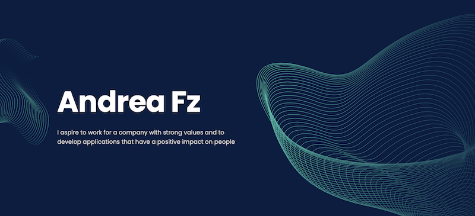

    <h1 align="center">Hello I'm <a targer="_blank" href="https://github.com/andfz" style="color : black">Andrea</a>, 42 Student</h1>

    <h2 align="center"> I am a newbie in this Big Tech World</h2>

  
  

  
  
  

* 👨‍💻 I’m currently working on these Skills : C / Shell / Algorithm / set up my own operating system while implementing strict rules / [...]
* 📖 Next I would like to learn React or Vue
* 🔭 Next to the next humbly become a (good) developer never stop learning
